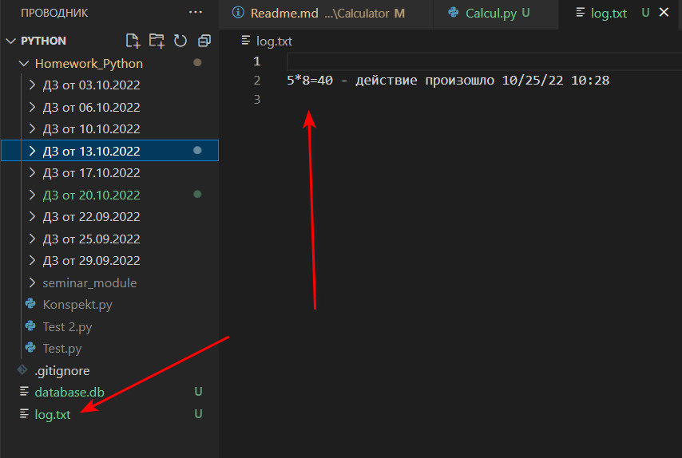
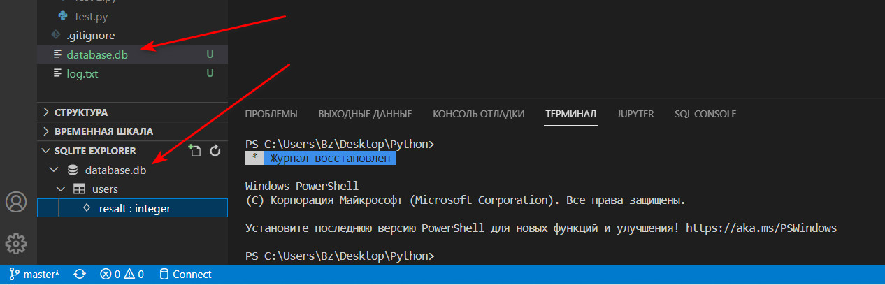
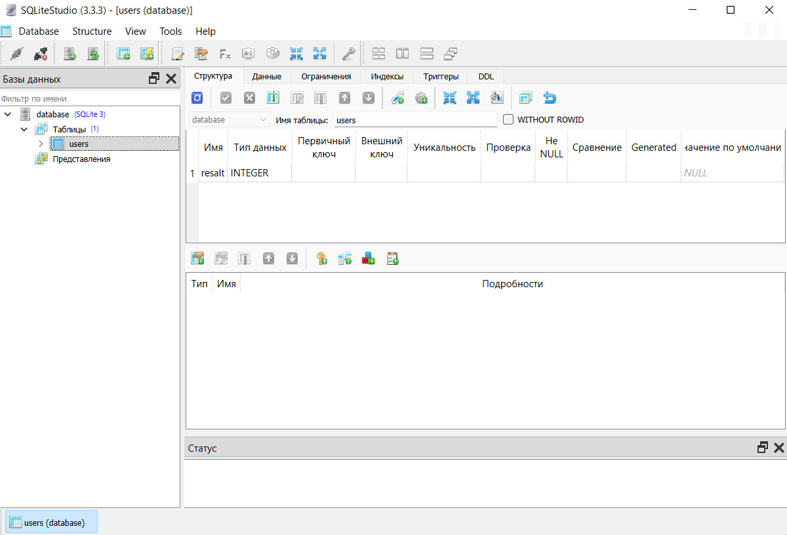

# Телеграм-бот "Калькулятор"

Для запуска бота необходимо ввести команду `/calculater`.

Начало работы телеграмм-бота:

Ввод математического действия:

Получение результата:

## Принцип работы

My_calc_bot работает через callBackData. Для этого достаточно просто нажать на желаемую ячейку с помощью курсора мыши.

Производится четыре основных математических операции: "/", "*", "+", "-".

Для работы бота необходимо иметь располагать библиотекой [python-telegram-bot](https://python-telegram-bot.org/). Для её установки воспользуйтесь командой:
`pip install python-telegram-bot`

### Все произведенные пользователем операции заносятся в файл log.txt с указанием времени действия.

### Результаты вычислений заносятся в базу данных "database.db" sqlite3.

## Установка и настройка

Для работы бота нужен токен. Чтобы его получить, необходимо написать телеграмм-боту [@BotFather](https://t.me/BotFather).
1) `/newbot` - команда для регистрации бота в телеграм.
2) после этого будет предложено написать имя бота.
3) дальше нужно выбрать username бота, то есть ссылку, по которой он будет доступен (такое имя выбрать не получится, т.к. оно уже занято, необходимо придумать уникальный username).

Если все действия были выполнены правильно, то [@BotFather](https://t.me/BotFather) пришлет текст, который будет содержать токен для работы бота:
`Use this token to access the HTTP API: <токен для работы бота>`

Затем в файле Calcul.py необходимо вставить полученный токен вместо фразы `'ВАШ ТОКЕН'`
